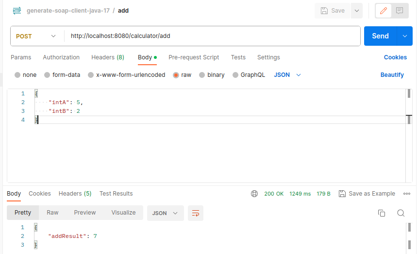

# Generate SOAP client with Java 17 and Spring Boot 3

This project generate a SOAP client for Calculator WS (http://www.dneonline.com/calculator.asmx?wsdl) and expose the ADD operation in REST (HTTP POST /calculator/add) endpoint.

## Build and generate SOAP client
    mvn clean install

## Run project
    mvn spring-boot:run

## Test endpoint

